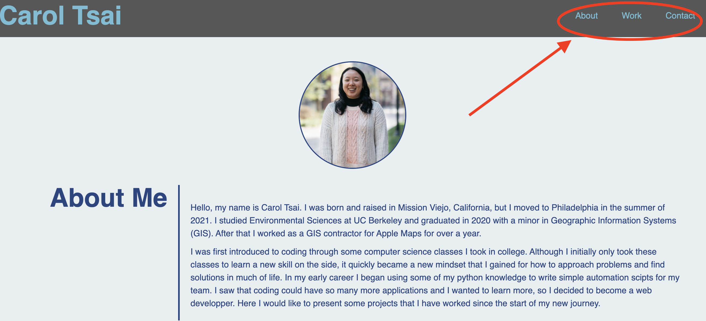

# developer-portfolio

## Description

This application is a webpage that will showcase my developer portfolio to potential employers. It includes different projects that showcase my skills and talents. The formatting and style of the page will showcase my own styles and skills in CSS. 

### What I learned
This project helped my grow comfortable with different CSS tools including the box model, flex box, and pseudo classes.

## Usage

The webpage can be found at [this link](https://carol-tsai.github.io/developer-portfolio/)

To view different sections of the page, you can click on the links in the bar on the top right.

To view my different projects you can click on the images in the "Work" section of the page.

## Credits

Assets and original code acquired through UPenn LPS Coding Bootcamp course material.

### Reference documents
* [CSS object-fit](https://www.w3schools.com/css/css3_object-fit.asp)
* [CSS Flexbox](https://css-tricks.com/snippets/css/a-guide-to-flexbox/)
* [CSS Filters](https://developer.mozilla.org/en-US/docs/Web/CSS/filter/)

## How to Contribute
Please reach out to me at carol.tsai0224@gmail.com if you would like to contribute to this project.

## License

MIT License

Copyright (c) 2022 Carol Tsai

Permission is hereby granted, free of charge, to any person obtaining a copy
of this software and associated documentation files (the "Software"), to deal
in the Software without restriction, including without limitation the rights
to use, copy, modify, merge, publish, distribute, sublicense, and/or sell
copies of the Software, and to permit persons to whom the Software is
furnished to do so, subject to the following conditions:

The above copyright notice and this permission notice shall be included in all
copies or substantial portions of the Software.

THE SOFTWARE IS PROVIDED "AS IS", WITHOUT WARRANTY OF ANY KIND, EXPRESS OR
IMPLIED, INCLUDING BUT NOT LIMITED TO THE WARRANTIES OF MERCHANTABILITY,
FITNESS FOR A PARTICULAR PURPOSE AND NONINFRINGEMENT. IN NO EVENT SHALL THE
AUTHORS OR COPYRIGHT HOLDERS BE LIABLE FOR ANY CLAIM, DAMAGES OR OTHER
LIABILITY, WHETHER IN AN ACTION OF CONTRACT, TORT OR OTHERWISE, ARISING FROM,
OUT OF OR IN CONNECTION WITH THE SOFTWARE OR THE USE OR OTHER DEALINGS IN THE
SOFTWARE.
